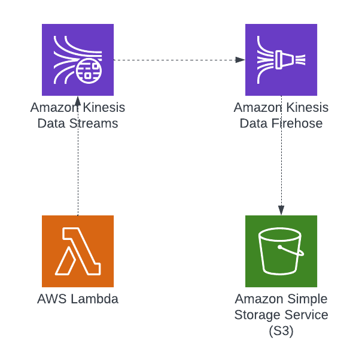

# Kinesis Datastream and Firehose Demo

This demo has been designed to help DevOps engineers learn how to use AWS Lambda, Kinesis Data Streams, and Kinesis Firehose to build real-time data processing pipelines. By deploying these services with CloudFormation, you can automate the deployment process and gain practical experience in building complex and reliable applications. This demo also provides hands-on training that allows you to learn how to process large amounts of streaming data in real-time and store the data in a durable and scalable way. Through this training exercise, you can deepen your understanding of how these tools work and how they can be used to build more advanced applications in the future. Ultimately, this demo serves as an excellent training resource for you to expand your skills and knowledge in real-time data processing and serverless architecture, which can help you enhance your career opportunities and achieve your professional goals.



here are the CLI commands you can use to deploy the AWS Lambda function with Kinesis Data Stream and Kinesis Firehose using the CloudFormation template and Python script we created earlier:


1. Create an S3 bucket where you can upload the CloudFormation template and Python script. You can use the following AWS CLI command:

```
aws s3 mb s3://<your-bucket-name> --region <your-preferred-region>
```
Replace <your-code-bucket-name> with your preferred bucket name, and <your-preferred-region> with the AWS region where you want to create the bucket.

2. Upload the CloudFormation template and Python script to the S3 bucket you just created. You can use the following AWS CLI commands:

```
zip function.zip index.py
aws s3 cp function.zip s3://<your-code-bucket-name>/
```

3.  Deploy the CloudFormation stack using the AWS CLI command:
note you will need to update the parameters file with desired parameters
```
aws cloudformation create-stack --stack-name <your-stack-name> --template-body file://kinesis.yaml --parameters file://parameters.json --capabilities CAPABILITY_NAMED_IAM

```


4. Wait for the CloudFormation stack to complete the creation process. You can use the following AWS CLI command to check the stack status:

```
aws cloudformation describe-stacks --stack-name <your-stack-name>
```
Replace <your-stack-name> with the name of your CloudFormation stack.
5. Once the stack creation is complete, you can use the following AWS CLI command to publish data to the Kinesis Data Stream:


```
aws kinesis put-record --stream-name demo-kinesis-data-stream --partition-key "<your-partition-key>" --data "$(echo -n '<your-data>' | base64)"
```
Replace <your-kinesis-stream-name>, <your-partition-key>, and your-data with your preferred values.

6. The data should be automatically delivered to the S3 bucket specified in the CloudFormation template. You can use the following AWS CLI command to verify that the data was delivered:

```
aws s3 ls s3://<your-firehose-bucket-name>/
```
Replace <your-firehose-bucket-name> with the name of the S3 bucket specified in the CloudFormation template or the parameters JSON file.
